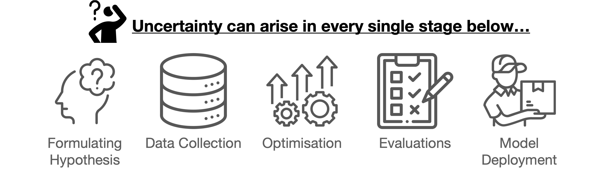
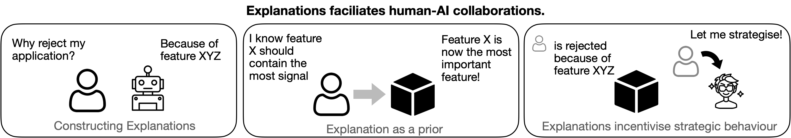
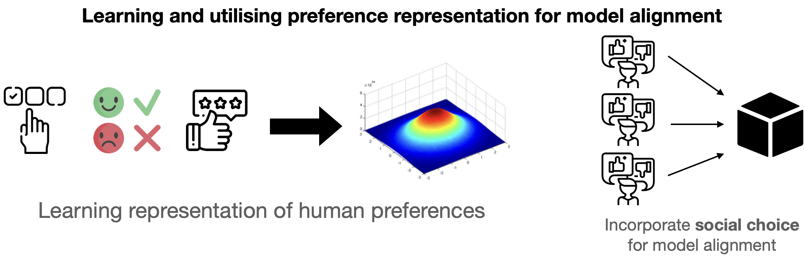

<html lang="en">
<meta name="viewport" content="width=device-width, initial-scale=1">
<head>
   <meta charset="UTF-8">
   <meta name="viewport" content="width=device-width, initial-scale=1.0">
  
</head>
<body>

    <h1> Research Interests</h1>
    

    Machine learning (ML) has seen rapid advancements in recent years, significantly enhancing its generative and predictive 
capabilities. These models clearly demonstrate <b>computational intelligence</b>—the ability to solve complex computational and 
mathematical problems by leveraging data-driven learning, pattern recognition, and optimization techniques.
    However, the lack of transparency and the overconfidence in these predictions have raised serious concerns about their reliability 
and safety in real-world applications. Moreover, the challenge of designing models that align with human and societal values remains 
unresolved.
    

    

    These issues can be attributed to the <b>lack of epistemic intelligence</b> in current ML systems. Epistemic intelligence refers to 
the ability to appreciate the limits of one’s knowledge, be honest about what is known, and navigate uncertainty and ambiguity 
regarding what is unknown. Effective communication and integration of knowledge is also a key component of epistemic intelligence.
    

    

    My research focuses on advancing the theory and practice of epistemic machine learning by focusing on three key directions: Uncertainty-aware ML, Explainable ML, and  
Preference Modelling.
    

    

    
    

 
<h2> Uncertainty-aware ML </h2>

Learning is an inductive process where we observe information from the world, interpret and internalise it, and generalise our 
experiences to new scenarios. 
Uncertainty is an inherent part of this process, emerging at various stages: from hypothesis formulation and data collection to model 
optimisation, performance evaluation,
and deployment. 
My research focuses on developing statistical methods to acknowledge, propagate, and utilise uncertainty throughout the machine 
learning development pipeline,
thereby enabling models to make reliable and safe decisions in real-world applications. 

 

<button type="button" class="collapsible">Click to see my relevant research experience! </button>

 
<h3> Uncertainty in data </h3>

When data are collected at varying granularities (e.g., different image resolutions or opinion pooling versus census data),
performing learning tasks on these data jointly becomes challenging. We studied this problem in our NeurIPS 2021 work 
<a href="https://arxiv.org/pdf/2105.12909">"Deconditional Downscaling with Gaussian Processes"</a>, where we model coarse observations as conditional expectations of fine-grained signals, and 
propose a novel **Deconditional Gaussian Process**, 
which allows us to "undo" this aggregation procedure and subsequently perform inference. This method 
integrates conditional mean embeddings, a flexible kernel method that operates on distributions with minimal parametric assumptions,
and Gaussian processes, a flexible model class known for effectively capturing uncertainty. We demonstrate its proficiency in an atmospheric field downscaling 
problem, where we show substantial improvements over existing methods.
 

In our NeruIPS 2021 work <a href="https://proceedings.neurips.cc/paper/2021/file/1ca5c750a30312d1919ae6a4d636dcc4-Paper.
pdf">Uncertainty Quantfication for Causal Data Fusion"</a>, 
we studied the causal data fusion problem, where datasets pertaining to multiple causal graphs are combined to estiamte
the average treatment effect of a target variable. As data arises from multiple sources and can vary in 
quality and quantity, principled uncertainty quantification becomes essential. We formulate this problem as an instance 
of learning over distributions, and propose a novel **Bayesian Conditional Mean Embeddings** to represent each distribution in the reproducing kernel Hilbert space 
(a flexible function space) while taking into account within each causal graph. The efficacy of our uncertainty is demonstrated 
through the task of Causal Bayesian optimisation, and show improvements over standard sampling-based methods.

<h3> Uncertainty in optimisation </h3>

Bayesian optimisation (BO) is an efficient blackbox function optimiser when function evaluations are expensive to compute and 
gradient information is not available.
The key insights behind BO is the use of acquisition function, which balances exploration and exploitation, to guide the search for an 
optimum. In our 
AISTATS 2024 work <a href="https://arxiv.org/abs/2310.17273"> "Collaborative and Explainable Bayesian Optimisation" </a>, we propose a new 
BO framework that learn expert's domain knowledge in the form of a preference function. This preference function is itself another Gaussian process, which by combining with the 
data-driven acquisition function, allows us to combine the expert's uncertainty into the search procedure, facilitating faster convergence to an optimum. We demonstrate our method's efficacy 
through human-AI teaming experiments in lithium-ion battery design, highlighting substantial improvements over conventional methods.
 
<h3> Uncertainty in evaluations </h3>

After model training, it is crucial to evaluate their performance to ensure they meet our expectations. In addition to 
classical approaches like analysing confusion matrices or accuracies, significant efforts have been made to unravel the blackbox model using explanation methods.
One such method is Shapley values, which attribute the model's predictions to individual features based on certain desirable fairness axioms. However,
these methods are often designed for non-probabilistic functions. In our NeurIPS 2023 spotlight work <a href="https://openreview.net/pdf?id=LAGxc2ybuH">"Stochastic Shapley values for Gaussian processes"</a>,
we argue that the uncertainty in model predictions also plays a critical role in evaluating a model's reliability. Therefore, it is essential
to develop a principled approach for uncertainty-aware feature attribution. We extend the Shapley value framework to 
stochastic cooperative games and propose a novel method called **Stochastic SHAP**. Additionally, we introduce a Gaussian process-specific method, 
GP-SHAP, which utilises the full analytical covariance structure presents in GPs to arrive at explanations that are also Gaussian random variables with fully tractable covariance structure. This 
covariance structure allows us to study statistical properties of the stochastic explanations, offering further insights into the blackbox function. GP-SHAP
has also been applied to explain Bayesian optimisation in our AISTATS 2024 work <a href="https://arxiv.org/abs/2310.17273"> "Collaborative and Explainable Bayesian Optimisation" </a>, 
where we show that the uncertainty-aware explanations can provide more reliable insights into the model's decision-making process.
 
<h3> Uncertainty in deployment </h3>

After model training and evaluation, the final step is to deploy the model in real-world applications. However, most off-the-shelf 
learning algorithms assume that training and deployment data are independently and identically distributed (IID). In practice, this assumption is often violated due to potential distribution shifts, adversarial attacks, and strategic manipulations. 
In our ICML 2024 spotlight work, <a href="https://arxiv.org/pdf/2404.04669">"Domain Generalisation via Imprecise Learning"</a>, we argue that without the IID assumption, it is no longer feasible to justify any “best” generalisation strategy. Instead, this becomes a context-specific choice problem. In other words, resolving this generalisation uncertainty requires subjective choices that should be made by the model consumer at deployment time, not by the model developer during training.
To operationalise this new perspective, we propose an Imprecise Learning framework. This framework includes an optimisation process that allows learners to remain imprecise during training, avoiding commitment to a specific generalisation notion. Additionally, it provides a model framework that enables operators to define their preferred generalisation strategy at deployment without the need for model retraining.

 
 

<h2> Explanation in ML </h2>

Machine learning has achieved remarkable success in delivering accurate predictions and impressive generation capabilities.
However, the opacity of these black-box models has limited their adoption in high-stakes applications.
Explanation algorithms like LIME and SHAP have been developed to elucidate these black-box models by creating more understandable surrogate models that
clarify the decision-making processes of complex systems. 
In addition to model explanations, human explanations can act as a form of prior knowledge, enhancing model performance by aligning it with expert insights.
My interest in this area focuses on developing novel algorithms that utilise explanations to enable more efficient and reliable human-AI collaboration.

 

<button type="button" class="collapsible">Click to see my relevant research experience! </button>

 
<h3> Constructing Explanations </h3>

 Location explanation methods such as LIME and SHAP are popular because of their model-agnostic and axiomatic properties. As long as 
one can evaluate the function,
one can deploy these methods to explain the model's predictions. However, we can often get further performance improvement (statistical or/and computational) by exploiting the model's structure.
For example, when using tree-based models, due to the decompositional properties of random forest, we can significantly reduce the computational cost of SHAP computation. In our NeurIPS 2022
work <a href="https://proceedings.neurips.cc/paper_files/paper/2022/hash/54bb63eaec676b87a2278a22b1bd02a2-Abstract-Conference.html">"RKHS-SHAP: Shapley Values for Kernel Methods"</a>, 
we propose the first SHAP-based algorithm for kernel methods. By utilising the reproducing kernel Hilbert space (RKHS) structure and conditional mean embedding, we can estimate the conditional value functions without relying on sampling or density estimation methods. 
This approach offers a significant advantage over other methods aim to estimate observational Shapley values. Another popular function class that utilises kernels is Gaussian process models.
In our NeurIPS 2023 spotlight work <a href="https://arxiv.org/abs/2305.15167">"Stochastic Shapley values for Gaussian processes"</a>, we extend RKHS-SHAP framework to Gaussian processes, allowing 
to estimate analytically both the mean and covariance of the conditional payoff functions, and subsequently leading to explanations that are now Gaussian random variables with analytical covariances. 
This leads to the first SHAP-based GP explanation algorithm, which we termed GP-SHAP. Besides specific model class, we also studied the problem of explaining general preference models, and proposed Pref-SHAP in our 
NeurIPS 2022 work <a href="https://arxiv.org/abs/2205.13662">"Explaining Preference with Shapley Values"</a> to address this problem. 

 
 
<h3> Utilising Explanations </h3>

 Explanations can also be treated as side information to facilitate learning. In our NeurIPS 2022 work <a 
href="https://proceedings.
neurips.cc/paper_files/paper/2022/hash/54bb63eaec676b87a2278a22b1bd02a2-Abstract-Conference.html">"RKHS-SHAP: Shapley Values for Kernel Methods"</a>,
we proposed an attribution prior based on Shapley functionals in the RKHS, which allows us to regulate the amount of contribution certain features have to the learned function. 
This method are then used in fair learning to minimise the amount of contribution a sensitive feature has to the model. Explanations can also be used to improve human-AI collaboration. In our AISTATS 2024 work <a href="https://arxiv.org/abs/2310.17273"> "Collaborative and Explainable Bayesian Optimisation" </a>,
we allow the Bayesian optimisation algorithm to suggest a pair of candidates each time, and let the human expert to choose the one for evaluation based on their domain knowledge. We showed that by 
explaining the acquisition function, thus letting the expert understands better why such candidate is selected, the human-AI teaming can achieve faster convergence than without explanations. Explanations can also act as 
an incentivising tool for changing user's behaviour. In our AAAI 2024 oral work <a href="https://arxiv.org/pdf/2308.16262"> "Causal Strategic Learning with Competitive Selection"</a>,
we studied by revealing the predictive model used for selection (e.g. hiring) can incentivise strategic agents to game the system. To combat that, we proposed solutions for decision makers to be robust against
gaming agents even when the model is revealed. 

 
 
<h2> Preference Modelling</h2>

Recent advancements in generative AI can be largely attributed to the successful integration of human preferences 
into correcting model behaviours that are otherwise difficult to quantify using purely observational data. 
While preference learning is a classical topic in statistics (e.g. Bradley-Terry models, Thurstone model), recent breakthroughs in
machine learning have opened up various new research avenues. My research in this direction aims to develop novel preference representation
learning algorithms that can effectively model human preferences using various forms of feedback data, including rankings, ratings, pairwise comparisons,
reviews, and choice data. Another interest of mine lies in integrating such representations into the decision-making processes of AI models, enabling them
to make decisions that are more aligned with human preferences.

 

<button type="button" class="collapsible">Click to see my relevant research experience! </button>

 
<h3> Preference learning </h3>

Preference learning is a classical topic in statistics, in which the goal is to learn a model that can predict the 
preferences of a 
user over a set of items.
Rank prediction is a common subtask in preference learning which can be briefly categorised into two types: probabilistic approaches based on 
likelihood such as Bradley Terry and Plucket-Luce models, or spectral approaches that apply spectral decomposition methods to the comparison matrices directly, such as the 
PageRank, SerialRank, SVDRank etc. In our ECML-PKDD 2022 work <a href="https://arxiv.org/pdf/2005.04035">"Spectral Ranking with Covariates"</a>,
we extended several classical spectral ranking algorithms to incorporate covaraites, which allows us now to predict rankings 
of new items albeit no prior comparisons have been made. If preference data is coming in the form of ratings, 
in our IEEE 2021 work <a href="https://arxiv.org/pdf/2008.10065">"Kernel-based Graph Learning from smooth signals: A Functional Viewpoint"</a>, we 
modelled the rating feedbacks as smooth graph signals generated from a latent comparison graph, and used kernel-based graph learning techniques to recover
this latent graph structure. We also challenged the classical assumption of preferences being transitive, and proposed a more realistic
non-parametric model to capture any form of preferences using our Generalised Preferential Gaussian Processes in our AISTATS 2022 work
<a href="https://arxiv.org/abs/2006.03847">Learning Inconsistent Preferences with Gaussian processes</a>. 

 
 
<h3> Preference utilisation </h3>

Once preference are learnt, we can utilise them in various applications to improve downstream performances by injecting 
hard to formulate human knowledge into the model. In our AISTATS 2024 work <a href="https://arxiv.org/abs/2310.17273"> "Collaborative and Explainable Bayesian Optimisation" </a>,
we demonstrated how preference model can be used as a prior to modify the acquisition procedure in Bayesian Optimisation to align more with expert's domain knowledge. 
This avoids the need for experts to specify precise priors over high dimensional input space that is known to be difficult for human to 
specify.  

</body>
</html>

