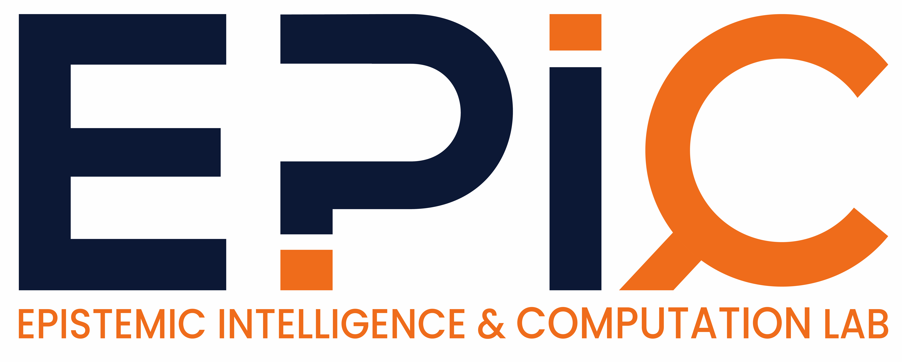

{: width="300" alt="EPIC Lab Logo" style="display:block; margin:auto;"}

The Epistemic Intelligence & Computation (EPIC) Lab is dedicated to understanding the underlying principles to develop 
uncertainty-aware intelligent systems that can recognise and communicate the limits of their knowledge. Specifically, we ask
<i>how should epistemic uncertainty be mathematically <b>represented, quantified, evaluated, compared, and explained?</b></i> To achieve that, our research
spans a variety of topics between machine learning and statistical methodologies, including:
<ul>
<li>Imprecise Probabilistic Machine Learning</li>
<li>Axiomatic Model Explainability</li>
<li>Probabilistic reasoning with Kernel methods and Gaussian Processes</li>
<li>Decision-making under Epistemic Uncertainty</li>
</ul>

We have openings for PhD students in Aug 2026 to be based in Singapore and are looking for candidates with strong mathematical,
statistical, or machine learning background, please get in touch if you are interested.

<h4> Current Members </h4>
- [Kaizheng Wang](https://scholar.google.com/citations?user=FbWkCh0AAAAJ&hl=en), _Postdoctoral research fellow @ NTU_
    - Previously PhD student @ KU Lueven, Belgium
    - Topic: Imprecise probabilistic machine learning
- [Clayton Chong](https://www.linkedin.com/in/clayton-chong-7b9a5514b/?originalSubdomain=hk), _PhD student @ NTU_
    - Previously Masters in Mathematics @ University of Oxford, United Kingdom
    - Topic: Decision-making under Epistemic Uncertainty for Cooperative Games
- [Yuqi Zhang](https://www.linkedin.com/in/yuqi-zhang-0b64bb1a6/?originalSubdomain=cn), _PhD student @ HKU (Main supervisor: Prof. Edwin Fong)_
    - Previously Masters in Mathematics & Statistics @ University of Oxford, United Kingdom
    - Topic: Uncertainty-aware Causal Inference
- Xiaotao Liu, _Undergraduate Research Student @ NTU_
    - Topics: Decision-making under Epistemic Uncertainty

<h4> Postdocs/PhD Students closely working with me </h4>
- [Anita Yang](https://www.linkedin.com/in/anita-yang-383204157/?originalSubdomain=nz), _PhD student @ University of Tokyo, Japan_
- [Anurag Singh](https://anurag14.github.io/), _PhD student @ CISPA, Germany_
- [Kiet Vo](https://kietqhvo.github.io/), _PhD student @ CISPA, Germany_
- [Joshua Sin](https://www.linkedin.com/in/joshua-sin-617278194/?originalSubdomain=ch), _PhD student @ Roche & EPFL, Switzerland_

<h4> Close Collaborators </h4>
- [Dino Sejdinovic](https://sejdino.github.io/), _Professor @ University of Adelaide, Australia_
- [Krikamol Muandet](https://www.krikamol.org/), _Chief Scientist @ CISPA, Germany_
- [Michele Caprio](https://michelecaprio.wixsite.com/caprio), _Lecturer (Assistant Professor) @ University of Manchester, United Kingdom_
- [Masaki Adachi](https://www.masaki-adachi.com/), _Principal Researcher @ Toyota Motor Corporation, Japan_
- [Majid Mohammadi](https://scholar.google.com/citations?user=7oVmQIYAAAAJ&hl=en), _Researcher @ Utretch University, Netherlands_

