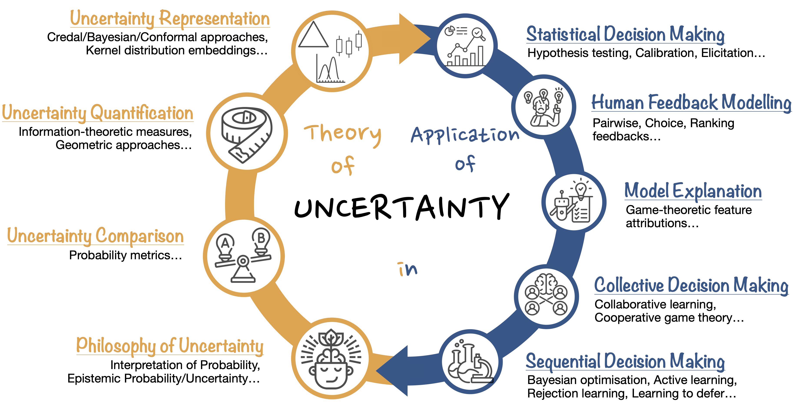

<html lang="en">
<meta name="viewport" content="width=device-width, initial-scale=1">
<head>
   <meta charset="UTF-8">
   <meta name="viewport" content="width=device-width, initial-scale=1.0">
  
</head>
<body>

<h1> Research Direction: Uncertainty-aware Machine Learning </h1>

As machine learning systems become increasingly powerful and pervasive, their lack of uncertainty awareness poses a critical challenge 
to their safe and trustworthy deployment. Despite remarkable advances in algorithms, architectures, and infrastructure, current models 
often fail to recognise and manage unfamiliar or ambiguous situations, leading to overconfident predictions and brittle behaviours—such 
as hallucinations in large language models. These vulnerabilities underscore the need for a principled understanding of uncertainty in 
machine learning, driving the development of the emerging field of uncertainty-aware machine learning. 

Uncertainty-aware machine learning is a broad, interdisciplinary field at the intersection of probability and statistics, economics, 
machine learning, and decision theory. <b> My research advances the theoretical foundations of uncertainty and leverages these insights to 
develop practical 
algorithms that provide mathematically rigorous solutions to real-world data science problems. </b>

 

 

 

<b> If any of these areas interests you, please don't hestiate to reach out for collaboration! </b>

 

<h4> Theory of Uncertainty </h4>

The theory of uncertainty is concerned with developing mathematical frameworks for representing, quantifying, and comparing uncertainty.
Beyond formal representations, I am also interested in how uncertainty should be interpreted, and how rational agents ought to 
represent ambiguity or partial knowledge in light of available evidence. While probability theory remains the dominant framework, it 
often fails to distinguish between different sources of uncertainty—such as aleatory uncertainty arising from inherent randomness, and 
epistemic uncertainty stemming from incomplete knowledge. This limitation has motivated the development of richer representations, 
including higher-order distributions (common in Bayesian modelling), sets of probabilities (as in imprecise probability theory), and 
set-valued predictions (such as conformal prediction and confidence intervals in frequentist statistics). Although each representation 
is useful in different scenarios and applications, coherently quantifying and comparing the degree of uncertainty they express remains 
an open and challenging problem. Understanding the philosophical foundations of these representations is equally important: it deepens 
our grasp of different types of uncertainty, helps justify when and why certain formalisms should be used, and offers a pathway to 
bridging human and machine reasoning through epistemological insights.

<h4> Application of Uncertainty </h4>

There are numerous application areas where improved uncertainty awareness and management can lead to significant gains. In sequential 
decision-making problems—such as reinforcement learning, Bayesian optimisation, and active learning—quantifying uncertainty  is 
essential for selecting the next “best” action. In collective decision-making, acknowledging uncertainty arising from conflicting  
opinions is key to maintaining objectivity and fairness when engaging multiple stakeholders. In model explanation, accounting for 
variability due to uncertainty can help users better understand the model’s behaviour and build trust in its predictions. In 
human-feedback modelling, uncertainty is pervasive—a simple binary signal can reflect either P(a >> b) = 0.5 or P(a >> b) = 1.0. 
Capturing such fuzziness in feedback is critical for proper model alignment. In statistical decision-making, where inference plays a 
central role, we reason about an unknown underlying distribution based on finite observations. There is a great deal of inductive 
reasoning involved, and handling uncertainty properly is essential for making sound decisions.

</body>
</html>

