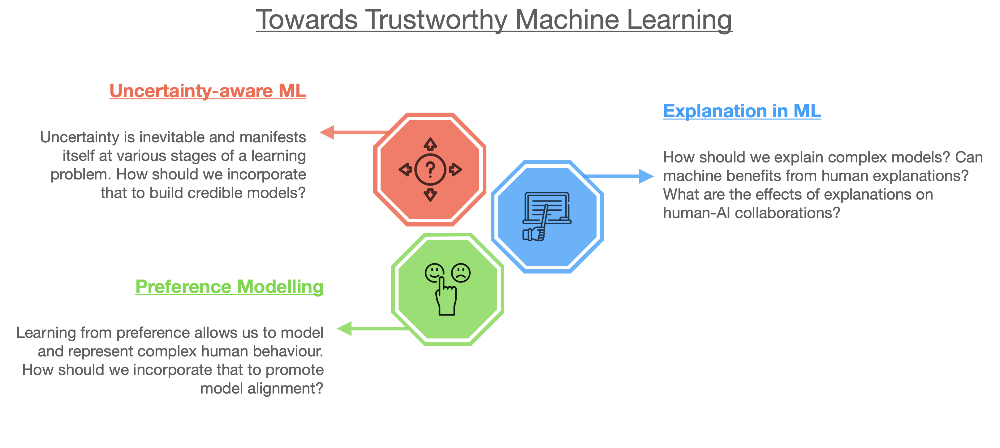

<h2> Research </h2>

Artificial Intelligence (AI) has seen rapid advancements in recent years, significantly enhancing its generative and predictive capabilities. However, the lack of transparency and the overconfidence in AI predictions have raised serious concerns regarding their reliability and safety. Additionally, the question of how to design AI models that align with and reflect human and societal values remains unresolved.

My research in Trustworthy Machine Learning aims to tackle these challenges by focusing on three key directions: Uncertainty-aware ML, Explanation in ML, and  Preference Modelling.

<h3> Uncertainty-aware ML </h3>

Learning is an inductive process where we observe information from the world, interpret and internalise it, and generalise our experiences to new scenarios. 
Uncertainty is an inherent part of this process, emerging at various stages: from hypothesis formulation and data collection to model optimisation, performance evaluation,
and deployment. 
My research focuses on developing statistical methods to acknowledge, propagate, and utilise uncertainty throughout the machine learning development pipeline,
thereby enabling models to make reliable and safe decisions in real-world applications. 

 

<h3> Explanation in ML </h3>

Machine learning has achieved remarkable success in delivering accurate predictions and impressive generation capabilities.
However, the opacity of these black-box models has limited their adoption in high-stakes applications.
Explanation algorithms like LIME and SHAP have been developed to elucidate these black-box models by creating more understandable surrogate models that
clarify the decision-making processes of complex systems. 
In addition to model explanations, human explanations can act as a form of prior knowledge, enhancing model performance by aligning it with expert insights.
My interest in this area focuses on developing novel algorithms that utilise explanations to enable more efficient and reliable human-AI collaboration.

 

<h3> Preference Modelling</h3>

Recent advancements in generative AI can be largely attributed to the successful integration of human preferences 
into correcting model behaviours that are otherwise difficult to quantify using purely observational data. 
While preference learning is a classical topic in statistics (e.g. Bradley-Terry models, Thurstone model), recent breakthroughs in
machine learning have opened up various new research avenues. My research in this direction aims to develop novel preference representation
learning algorithms that can effectively model human preferences using various forms of feedback data, including rankings, ratings, pairwise comparisons,
reviews, and choice data. Another interest of mine lies in integrating such representations into the decision-making processes of AI models, enabling them
to make decisions that are more aligned with human preferences.

 

